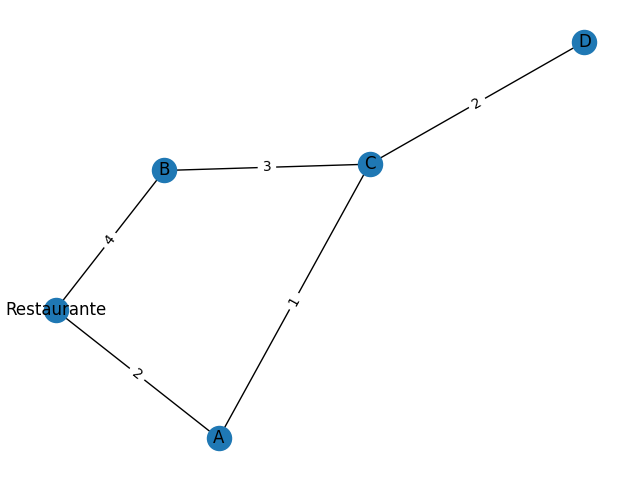

# 🚚 Rota Inteligente: Otimização de Entregas com Algoritmos de IA

**Disciplina:** Artificial Intelligence Fundamentals  
**Aluno:** Elias Kalil Maniá Saffi  
**R.A.:** 178808  

---

# 📌 Descrição do Problema

A empresa fictícia **Sabor Express**, que atua no setor de delivery de alimentos, enfrenta dificuldades para gerenciar suas rotas de entrega durante horários de pico, especialmente no almoço e no jantar.

Atualmente os trajetos são definidos manualmente pelos entregadores, com base apenas em experiência prática. Esse processo gera diversos problemas:

- Rotas ineficientes
- Atrasos nas entregas
- Maior consumo de combustível
- Aumento dos custos operacionais
- Insatisfação dos clientes

Diante desse cenário, surge a necessidade de desenvolver uma solução tecnológica capaz de **otimizar automaticamente o planejamento das rotas de entrega**.

---

# 🎯 Objetivos

## Objetivo Geral

Desenvolver uma solução baseada em **Inteligência Artificial** capaz de sugerir rotas eficientes para entregadores, minimizando distância percorrida e tempo de entrega.

## Objetivos Específicos

- Representar a cidade como um **grafo**
- Implementar algoritmos de busca para encontrar **o menor caminho**
- Agrupar entregas próximas usando **clustering**
- Reduzir distância percorrida
- Melhorar eficiência logística das entregas

---

# 🧠 Abordagem da Solução

A solução proposta combina **Teoria dos Grafos**, **Algoritmos de Busca** e **Aprendizado de Máquina Não Supervisionado**.

O funcionamento ocorre em três etapas principais:

### 1️⃣ Representação da Cidade como Grafo

A cidade é modelada como um **grafo**:

- **Nós (vértices)** → bairros ou pontos de entrega
- **Arestas** → ruas entre os locais
- **Peso das arestas** → distância ou tempo estimado

Essa representação permite que algoritmos encontrem rotas eficientes.

---

### 2️⃣ Otimização de Rotas

Para encontrar o menor caminho entre pontos da cidade utilizamos algoritmos clássicos de busca.

O algoritmo principal utilizado foi **A\***.

A função do A* é:

f(n) = g(n) + h(n)

Onde:

- **g(n)** = custo do caminho percorrido até o nó atual
- **h(n)** = estimativa heurística até o destino

Isso permite encontrar caminhos eficientes sem explorar todo o grafo.

---

### 3️⃣ Agrupamento de Entregas

Quando existem muitos pedidos simultâneos, utilizamos **K-Means** para agrupar entregas próximas geograficamente.

Benefícios:

- divisão das entregas por região
- redução de deslocamentos desnecessários
- melhor distribuição de trabalho entre entregadores

---

# ⚙️ Algoritmos Utilizados

## A* (A-Star)

Algoritmo de busca heurística utilizado para encontrar o menor caminho entre dois pontos em um grafo.

Vantagens:

- alta eficiência
- reduz espaço de busca
- muito usado em navegação e logística

---

## BFS (Busca em Largura)

Explora o grafo **nível por nível**.

Características:

- encontra caminhos com menor número de arestas
- útil para análise estrutural do grafo

---

## DFS (Busca em Profundidade)

Explora um caminho completamente antes de voltar e testar outros caminhos.

Características:

- útil para explorar todas as possibilidades de rotas
- utilizado em diversos problemas de grafos

---

## K-Means Clustering

Algoritmo de **aprendizado não supervisionado** usado para agrupar dados semelhantes.

No projeto ele é utilizado para:

- agrupar entregas próximas
- definir regiões de atendimento

---

# 🗺️ Diagrama do Grafo Utilizado

O modelo de cidade foi representado como um grafo.

Exemplo simplificado:

```
        Bairro B
        /     \
      3km     2km
      /         \
Restaurante --- 4km --- Bairro C
      \         /
      1km      2km
        \     /
        Bairro A
```

No projeto real o grafo é **gerado automaticamente por código**, produzindo uma imagem salva em:

```
outputs/grafo.png
```

Essa imagem pode ser exibida no README assim:

```markdown

```

---

# 📊 Análise dos Resultados

Após aplicar os algoritmos de IA, foram observados os seguintes resultados:

### Resultados obtidos

- agrupamento eficiente de entregas próximas
- redução da distância média percorrida
- melhor distribuição das rotas entre entregadores
- visualização clara do sistema logístico

### Benefícios para a empresa

- redução de custos com combustível
- maior número de entregas por hora
- melhoria da experiência do cliente

---

# ⚠️ Limitações Encontradas

Apesar dos resultados positivos, algumas limitações foram identificadas:

- o modelo não considera **trânsito em tempo real**
- os dados de cidade são **simulados**
- o sistema não trata **pedidos dinâmicos chegando durante a rota**

---

# 🚀 Sugestões de Melhoria

Possíveis evoluções do projeto incluem:

- integração com **Google Maps ou OpenStreetMap**
- uso de **dados de trânsito em tempo real**
- implementação de **algoritmos genéticos**
- aplicação de **aprendizado por reforço**
- otimização para múltiplos entregadores simultâneos

---

# 🏁 Conclusão

Este projeto demonstra como conceitos fundamentais de **Inteligência Artificial, grafos e aprendizado de máquina** podem ser aplicados para resolver problemas reais de logística.

A combinação de:

- **Algoritmos de busca (A\*)**
- **Representação em grafos**
- **Clustering com K-Means**

permite desenvolver um sistema capaz de **otimizar rotas de entrega**, reduzir custos operacionais e melhorar a eficiência de empresas de delivery.
